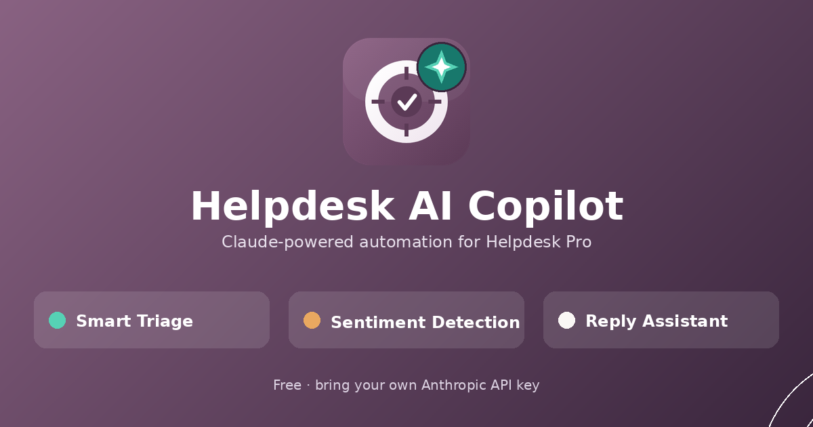
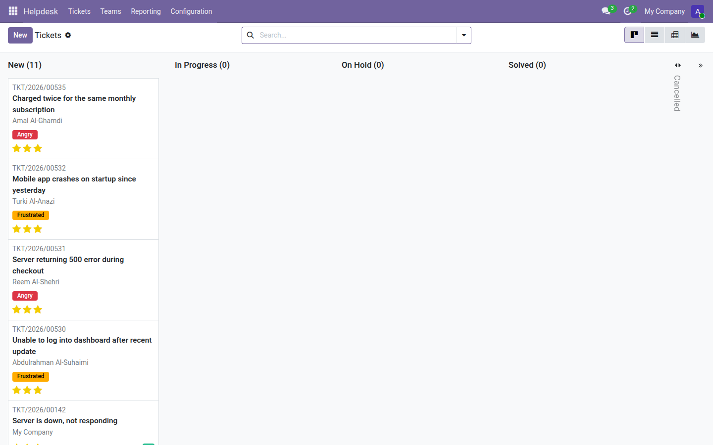
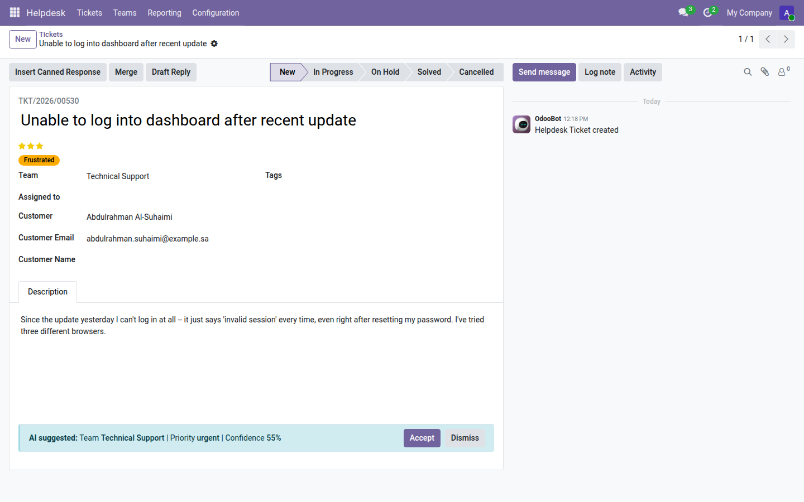
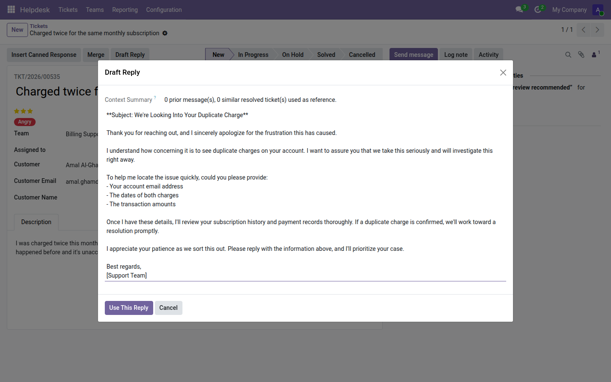
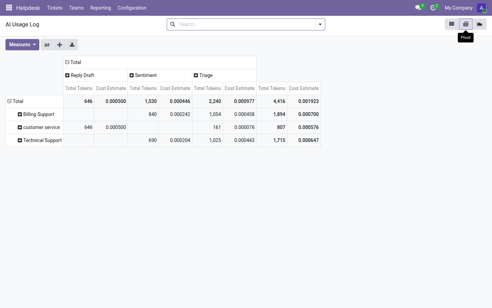
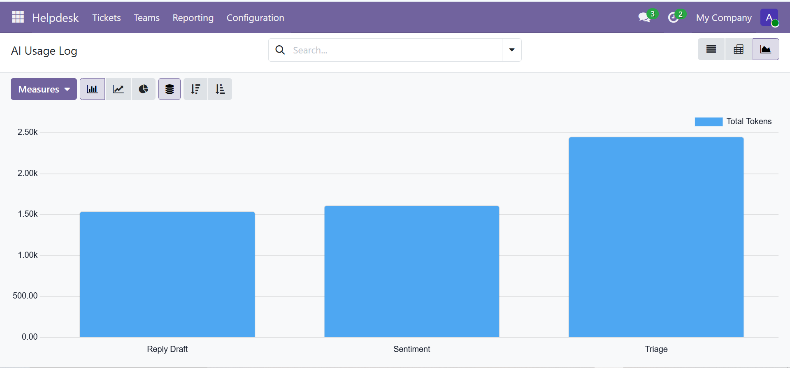
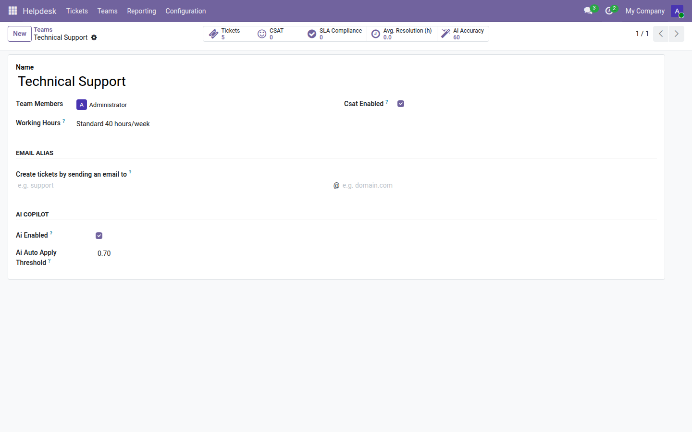
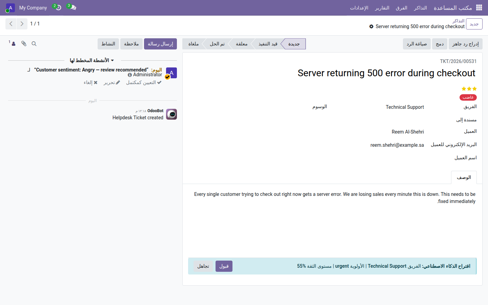

# Helpdesk AI Copilot

[](https://github.com/Zahoor-ishfaq/odoo-helpdesk-pro-ai/actions/workflows/ci.yml)
[](LICENSE)
[](https://www.odoo.com)
[](helpdesk_community_pro_ai/i18n/ar.po)



Anthropic Claude-powered **Smart Triage**, **Sentiment Detection**, and
a **Reply Assistant** for [Helpdesk Pro](https://github.com/Zahoor-ishfaq/odoo-helpdesk-pro) —
free, no Enterprise license, bring your own API key.

Built for **Odoo 19.0 Community**, on top of `helpdesk_community_pro`.

## Features

- **Smart Triage** — on ticket create, Claude suggests a team,
  priority, and tags. High-confidence suggestions apply automatically;
  low-confidence ones show as a banner with Accept/Dismiss.
- **Sentiment Detection** — every genuine inbound message (email or
  portal/chatter, not an agent's own note) is scored calm / neutral /
  frustrated / angry. An angry ticket auto-escalates to Urgent
  priority and notifies the team's managers.
- **Reply Assistant** — a "Draft Reply" button reads the ticket's
  recent conversation plus similar resolved tickets, and drafts an
  editable reply. The AI never sends anything itself — the agent
  always reviews, edits, and sends.
- **Usage Dashboard** — a pivot/graph AI Usage Log (calls, tokens,
  cost estimate) plus a per-team AI Accuracy stat button.
- **Demo data & i18n** — install with a realistic demo dataset showing
  all three AI features already in action; ships with an Arabic (`ar`)
  translation alongside the English source strings.

See the [user guide](helpdesk_community_pro_ai/docs/user-guide.md)
(also available [in Arabic](helpdesk_community_pro_ai/docs/user-guide-ar.md))
for a full walkthrough, and
[api-setup.md](helpdesk_community_pro_ai/docs/api-setup.md) for how to
get an Anthropic API key and set a spending limit.

## Screenshots

<table>
<tr>
<td width="50%">

**Ticket kanban** — live sentiment badges and priority stars



</td>
<td width="50%">

**Smart Triage** — Accept/Dismiss banner with a confidence score



</td>
</tr>
<tr>
<td width="50%">

**Reply Assistant** — a genuine Claude-drafted reply, ready to edit



</td>
<td width="50%">

**Usage Dashboard** — pivot view by team and call type



</td>
</tr>
<tr>
<td width="50%">

**Usage Dashboard** — token usage by call type



</td>
<td width="50%">

**Team settings** — the AI Accuracy stat button



</td>
</tr>
</table>

The full interface also works right-to-left in Arabic:



## Install

1. Install [**Helpdesk Pro**](https://github.com/Zahoor-ishfaq/odoo-helpdesk-pro)
   first (`helpdesk_community_pro`) — this module depends on it.
2. Copy (or clone) the `helpdesk_community_pro_ai/` folder into your
   Odoo addons path.
3. Restart Odoo and update the apps list.
4. Install **Helpdesk AI Copilot** from Apps.
5. Add an Anthropic API key under **Settings ▸ General Settings ▸
   Helpdesk AI** — see
   [api-setup.md](helpdesk_community_pro_ai/docs/api-setup.md).

No AI feature calls the API without a valid key configured, and every
feature is off by default until a team opts in (**AI Enabled** on the
team form).

## Local development

```bash
docker compose up      # Odoo 19.0 → http://localhost:8079
```

Run the test suite inside a container:

```bash
docker compose run --rm web odoo -d test19 \
  -i helpdesk_community_pro,helpdesk_community_pro_ai \
  --test-enable --test-tags /helpdesk_community_pro_ai --stop-after-init
```

Lint before committing:

```bash
pre-commit run -a
```

## Feedback

Suggestions and bug reports are always welcome — please open a
[GitHub issue](https://github.com/Zahoor-ishfaq/odoo-helpdesk-pro-ai/issues).

## License

[LGPL-3](LICENSE)
